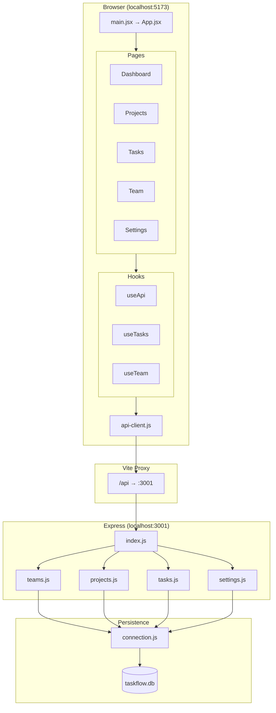

# Architecture Overview

TaskFlow is a B2B project management practice app: React SPA + Express REST API + SQLite. Classic client-server separation with a thin API client and hook-based data fetching.

---

## System Architecture

### Layers

| Layer | Path | Role |
|-------|------|------|
| **Client** | `client/` | React 18 SPA (Vite), port **5173** |
| **Server** | `server/` | Express REST API, port **3001** |
| **Database** | `server/db/` | SQLite via better-sqlite3 |
| **Tests** | `tests/` | API integration + component unit tests |

### Data flow

1. **Page/component** calls `useApi('/tasks')`, `useTasks(filters)`, or `useTeam()`.
2. **Hook** (`client/src/hooks/useApi.js`) manages `data`, `loading`, `error` and calls `api.get(endpoint)`.
3. **API client** (`client/src/utils/api-client.js`) issues `fetch('/api/...')`.
4. **Vite dev proxy** (`client/vite.config.js`) forwards `/api/*` → `http://localhost:3001`.
5. **Express** (`server/index.js`) applies CORS, JSON parser, logger, mock `req.user`, then route handler.
6. **Route** (`server/routes/*.js`) calls `getDb()` from `server/db/connection.js`.
7. **SQLite** runs prepared statements; handler returns JSON.

**Mutations** (create project/task) call `api.post` directly from pages, then `refetch()`. No Redux or shared cache — each page re-fetches on mount.

**Auth:** Hardcoded mock user in `server/index.js` (`req.user` id: 1, "You", Product Manager). No tokens or sessions.

### Architecture diagram



### Client routing

| Path | Page | Data sources |
|------|------|--------------|
| `/` | Dashboard | `useApi('/tasks')`, `useApi('/projects')` |
| `/projects` | Projects | `useApi('/projects')` + `api.post` on create |
| `/tasks` | Tasks | `useTasks`, `useTeam`, `useApi('/projects')` |
| `/team` | Team | `useTeam()` |
| `/settings` | Settings | `useApi('/settings')` (read-only toggles) |

### API surface

| Mount | Methods |
|-------|---------|
| `/api/team` | GET `/`, `/:id`, `/:id/tasks` |
| `/api/projects` | GET, GET `/:id`, POST, PUT, DELETE |
| `/api/tasks` | GET (filters), GET `/:id`, POST, PUT, DELETE |
| `/api/settings` | GET, PUT |
| `/api/health` | GET |

### Database schema

| Table | Purpose |
|-------|---------|
| `team_members` | Users (referenced by projects and tasks) |
| `projects` | Projects with `owner_id` FK |
| `tasks` | Work items with `assignee_id`, `project_id` FKs |
| `settings` | Key-value app config |

---

## Tech Stack

| Layer | Technology | Version |
|-------|------------|---------|
| Frontend UI | React | ^18.3.1 |
| Routing | react-router-dom | ^6.23.1 |
| Build | Vite | ^5.2.13 |
| Backend | Express | ^4.19.2 |
| Database | better-sqlite3 | ^11.1.2 |
| Testing | Vitest + React Testing Library | ^1.6.0 |
| Dev orchestration | concurrently | ^8.2.2 |

**Not used:** TypeScript, Redux/Zustand, CSS modules, styled-components, ESLint/Prettier in repo.

---

## UI Components & Design Patterns

### Reusable components (15 total)

| Domain | Components |
|--------|------------|
| **common/** | `Button`, `Modal`, `Badge`, `Spinner` |
| **tasks/** | `TaskRow`, `TaskBoard`, `TaskForm`, `StatusBadge` |
| **projects/** | `ProjectCard`, `ProjectList`, `ProjectForm` |
| **dashboard/** | `Stats`, `RecentActivity` |
| **team/** | `MemberCard`, `MemberList` |

### Design tokens (`client/src/styles/tokens.css`)

- **Brand:** `--color-primary` (#e63f02), `--color-accent` (#fcc403)
- **Neutrals:** `--color-bg`, `--color-surface`, `--color-text`, etc.
- **Status:** success, warning, error, info (+ light variants)
- **Priority:** urgent, high, medium, low
- **Typography:** Outfit font, `--font-size-xs` through `--font-size-3xl`
- **Spacing:** 8pt grid `--space-1` through `--space-16`
- **Layout:** `--sidebar-width` (240px), border radii, shadows

### Style approach

- **Tokens** in CSS custom properties (`tokens.css` → `globals.css`)
- **App shell & forms** via global classes (`.sidebar`, `.card`, `.form-group`)
- **Components** use **inline style objects** referencing tokens — no CSS modules
- **Hover** on `Button` via React state, not CSS `:hover`

### Patterns to reuse

1. **Modal + form CRUD** — `Modal` wrapping `*Form`, ghost Cancel + primary Submit
2. **Semantic badges** — extend `Badge` `colorMap` for new status types
3. **Card surfaces** — surface bg + border + radius-lg + padding
4. **Loading/empty** — `<Spinner />` while loading; muted centered empty states
5. **Page structure** — `.page-header` + primary CTA in header row

---

## Key Files Reference

| File | Purpose |
|------|---------|
| `client/src/main.jsx` | React entry, BrowserRouter |
| `client/src/App.jsx` | Sidebar layout + routes |
| `client/src/utils/api-client.js` | Fetch wrapper for `/api/*` |
| `client/src/hooks/useApi.js` | Generic data-fetching hook |
| `client/src/hooks/useTasks.js` | Tasks hook with filters + `updateTask` |
| `client/src/styles/tokens.css` | Design system tokens |
| `server/index.js` | Express app, mock user, route mounting |
| `server/db/connection.js` | SQLite singleton, auto schema+seed |
| `server/routes/tasks.js` | Task CRUD + query filters |
| `server/routes/projects.js` | Project CRUD |
| `vitest.config.js` | Root test runner config |

---

## Development Workflow

```bash
# One-time setup
npm run install:all

# Daily dev (client :5173 + server :3001)
npm run dev

# Run all tests
npm test

# Reset database
cd server && npm run db:reset

# Production build (client only)
cd client && npm run build
```

**Dev topology:** `npm run dev` → Vite (5173) proxies `/api` → Express (3001) → SQLite.
