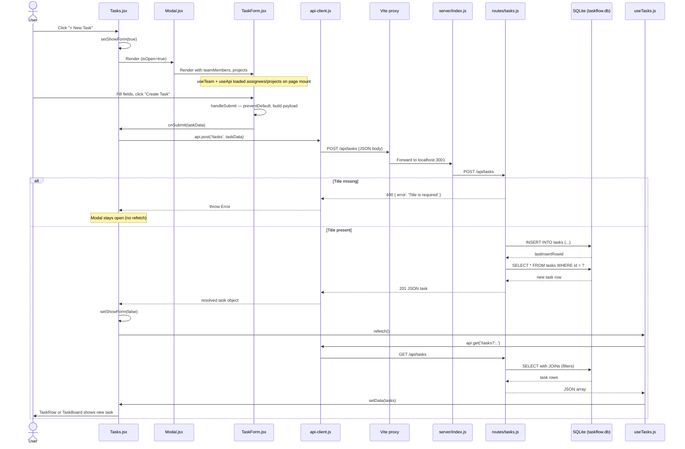

# Task Creation Flow

End-to-end trace: user clicks **+ New Task** → task appears in the list or board.

---

## Sequence Diagram



---

## Numbered Walkthrough

### 1. User opens the form (`Tasks.jsx`)

- **+ New Task** button calls `setShowForm(true)` (line 52).
- `Modal` renders with `title="New Task"` and wraps `TaskForm`.
- Page already loaded `teamMembers` via `useTeam()` and `projects` via `useApi('/projects')` for dropdowns.

### 2. User submits (`TaskForm.jsx`)

- Form fields held in local `useState` (title, status, priority, assignee, project, due date, hours).
- **Create Task** triggers `handleSubmit`:
  - `e.preventDefault()` stops page reload.
  - Builds payload: snake_case keys (`assignee_id`, `project_id`, `due_date`) for the API.
  - Empty assignee/project → `null`; empty due date → `null`.
- HTML5 `required` on title field (browser validation before submit).

### 3. Page handles create (`Tasks.jsx` → `handleCreate`)

```javascript
const handleCreate = async (taskData) => {
  await api.post('/tasks', taskData);
  setShowForm(false);
  refetch();
};
```

- Calls `api.post` — does **not** use `useTasks` for the write.
- On success: closes modal, calls `refetch()` from `useTasks`.
- On failure: `api.post` throws → modal stays open, no list refresh.

### 4. HTTP client (`api-client.js`)

- `POST /api/tasks` with `Content-Type: application/json`.
- Body stringified from the task object.
- Vite dev server proxies `/api` → `http://localhost:3001`.
- If `!response.ok`, parses error JSON and throws `Error` with message.

### 5. Server route (`server/routes/tasks.js`)

- `POST /` handler reads `req.body`.
- **Validation:** returns `400` if `title` is missing.
- **Defaults:** `status` → `'todo'`, `priority` → `'medium'`, `description` → `''`, `estimated_hours` → `0`.
- **INSERT** into `tasks` table via `better-sqlite3` prepared statement.
- **SELECT** new row by `lastInsertRowid`, respond `201` with task JSON (no JOIN on create response).

### 6. List refresh (`useTasks.js`)

- `refetch()` re-runs `fetchData`.
- `GET /api/tasks` with current filter query string (`status`, `priority`).
- Server returns tasks with `assignee_name` and `project_name` JOINs.
- `setData(result)` updates React state → list re-renders `TaskRow` or `TaskBoard`.

---

## Files in the Chain

| Step | File | Role |
|------|------|------|
| UI trigger | `client/src/pages/Tasks.jsx` | Modal state, `handleCreate`, list/board render |
| Form | `client/src/components/tasks/TaskForm.jsx` | Collect & shape payload |
| Shell | `client/src/components/common/Modal.jsx` | Overlay dialog |
| HTTP | `client/src/utils/api-client.js` | `fetch` + error handling |
| Proxy | `client/vite.config.js` | `/api` → port 3001 |
| Router | `server/index.js` | Mounts `/api/tasks` |
| API | `server/routes/tasks.js` | Validation, INSERT, response |
| DB | `server/db/connection.js` | SQLite connection |
| Refresh | `client/src/hooks/useTasks.js` | GET after create |

---

## Validation & Error Handling

| Layer | What happens |
|-------|----------------|
| **Browser** | Title `required` on input |
| **Client app** | No explicit check beyond HTML5; failed POST leaves modal open |
| **API** | `400` if title missing; `404` on GET/PUT/DELETE for unknown id |
| **Database** | FK constraints on `assignee_id`, `project_id` (invalid IDs would error) |

---

## Symptom → Layer Mapping

| User report | Likely layer |
|-------------|----------------|
| Submit button does nothing | `TaskForm` / browser validation (empty title) |
| Error message, modal stays open | `api-client` / server `400` |
| Modal closes, task missing from list | `refetch()` / GET filters / `useTasks` state |
| Task in DB but wrong assignee name | GET JOIN query, not POST response |
